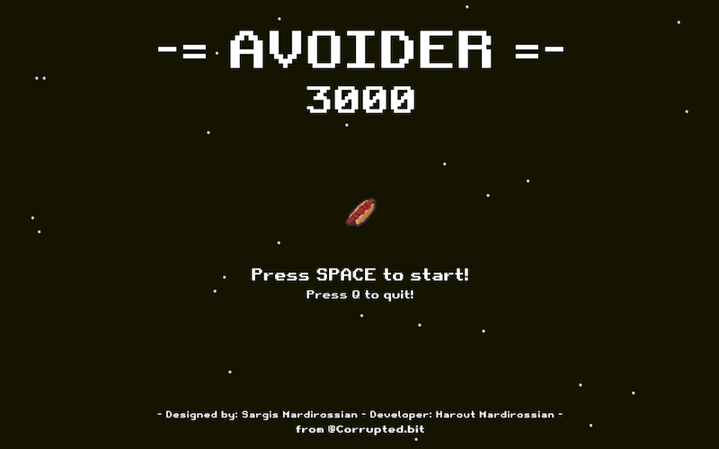

# -= AVOIDER 3000 =-

What is **Avoider 3000**? This is a retro-endless-arcade game based on space shooters from 80s arcade machines.
The game is taken from the pygames library and only adapted for serial input. The original **Avoider 3000** can be found here: https://github.com/crusty0gphr/avoider-3000

The required input is:

0 - nothing

1 - move left

2 - move right

3 - shoot

There is currently no error implemented for wrong input, it will just crash.

The purpose is to record and decode EMG using a microcontroller and assign output based on the decoded EMG activity, but it is possible to use any other signal.
COM-port is hardcoded to COM9.

## Game writen using Python with **PyGame** Module

### Developer dependencies

### How to run
in terminal:
```
~ pip install -r requirements.txt
~ python main.py
```

Game developed using **Python 3.7.2**, adapted on **Python 3.13.11** and tested on **Python 3.13.11**

## Screenshots

### Main Menu


### Gameplay Screen

#
### The game is still in development.
Next update will include error handling for wrong serial input.
